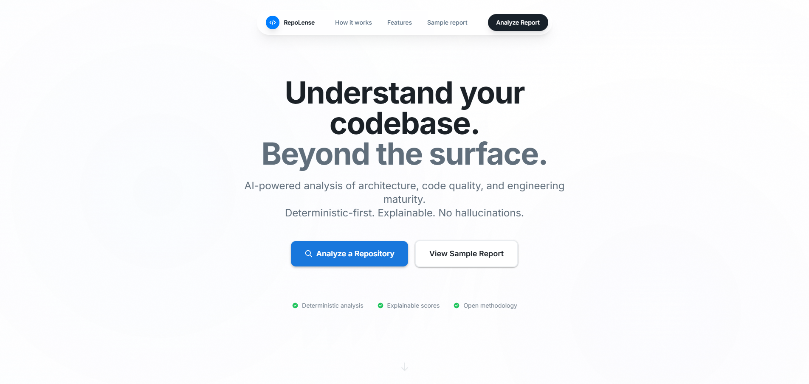
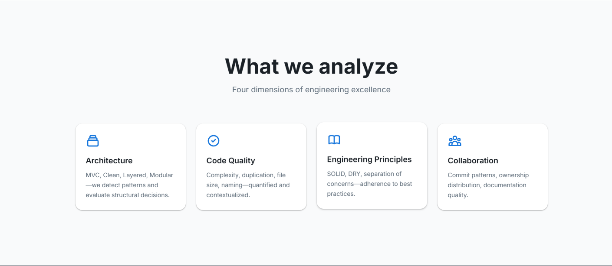
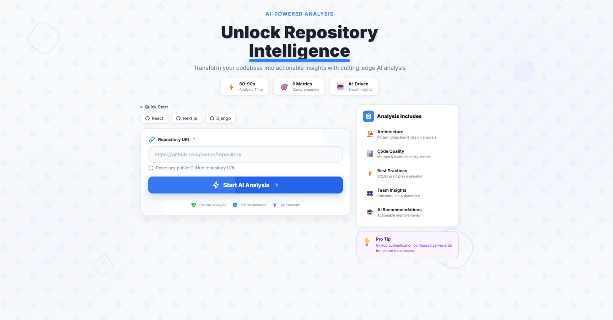
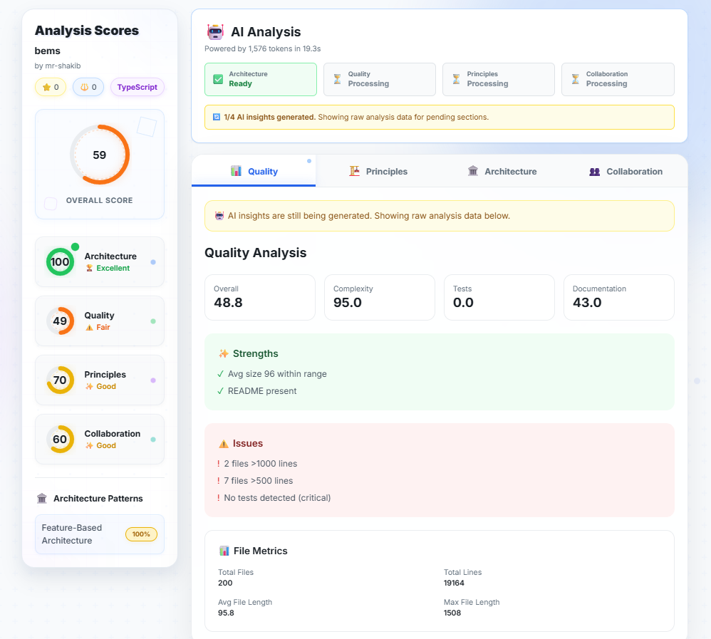

<div align="center">

<!-- 📸 ADD IMAGE: Create a banner image (1200x400px) showing your logo/name with a gradient background -->
<!-- Save as: docs/images/banner.png -->


# 🔍 RepoLense AI

**AI-Powered GitHub Repository Analysis Platform**

Transform repository evaluation with intelligent insights on architecture, code quality, and engineering excellence.

[](https://repolense.vercel.app)
[](https://repolense-backend-rpu7.onrender.com)
[](LICENSE)
[](https://www.djangoproject.com/)
[](https://nextjs.org/)
[](https://www.python.org/)

[🚀 Live Demo](https://repolense.vercel.app) • [📖 Documentation](docs/) • [🐛 Report Bug](../../issues) • [✨ Request Feature](../../issues)

</div>

---

## 📋 Table of Contents

- [Overview](#-overview)
- [Key Features](#-key-features)
- [Demo](#-demo)
- [Tech Stack](#-tech-stack)
- [Architecture](#-architecture)
- [Getting Started](#-getting-started)
- [Deployment](#-deployment)
- [API Documentation](#-api-documentation)
- [Contributing](#-contributing)
- [License](#-license)
- [Contact](#-contact)

---

## 🎯 Overview

**RepoLense AI** is a production-grade SaaS platform that provides deep, AI-powered analysis of GitHub repositories. It helps **recruiters** objectively evaluate engineering candidates and **developers** gain insights to improve their code quality.

### 🎪 Target Users

| User Type | Use Case |
|-----------|----------|
| 🎯 **Recruiters** | Objectively evaluate engineering candidates' real-world code quality |
| 👨‍💻 **Developers** | Get actionable insights to improve repository health and best practices |
| 🏢 **Tech Leads** | Assess team code quality and identify areas for improvement |
| 📊 **Engineering Managers** | Track code quality metrics across projects |

---

## ✨ Key Features

<div align="center">

<!-- 📸 ADD IMAGE: Create a features grid (1000x600px) showing 4 quadrants with icons for each feature -->
<!-- Save as: docs/images/features.png -->


</div>

### 🏛️ Architecture Analysis
- **Pattern Detection** - Identifies architectural patterns (MVC, Clean Architecture, Microservices)
- **Layer Isolation** - Validates separation of concerns and dependency rules
- **Modularity Score** - Measures code organization and module cohesion

### 🎨 Code Quality Assessment
- **Complexity Metrics** - Cyclomatic complexity, maintainability index
- **Code Smells** - Detects anti-patterns and technical debt
- **Best Practices** - Validates naming conventions, documentation, type safety

### 🤖 AI-Powered Insights
- **Intelligent Summaries** - Natural language analysis of repository health
- **Actionable Recommendations** - Specific suggestions for improvement
- **Trend Analysis** - Identifies patterns and potential issues

### 👥 Collaboration Metrics
- **Commit Patterns** - Analyzes development workflow and team dynamics
- **Contribution Quality** - Evaluates meaningful vs. superficial changes
- **Documentation Coverage** - Assesses README, comments, and inline docs

---

## 🎬 Demo

<div align="center">

<!-- 📸 ADD IMAGE: Screenshot of your landing page (1200x800px) -->
<!-- Save as: docs/images/screenshot-home.png -->


### Analysis Dashboard

<!-- 📸 ADD IMAGE: Screenshot of analysis results page (1200x800px) -->
<!-- Save as: docs/images/screenshot-results.png -->


### Report Breakdown

<!-- 📸 ADD IMAGE: Screenshot showing detailed metrics and scores (1200x800px) -->
<!-- Save as: docs/images/screenshot-breakdown.png -->


</div>

**🔗 Try it now:** [https://repolense.vercel.app](https://repolense.vercel.app)

---

## 🛠️ Tech Stack

<div align="center">

### Frontend


### Backend


### AI & Analysis


### Deployment


</div>

---

## 🏗️ Architecture

This project follows **Clean Architecture** principles with strict layer isolation:

<div align="center">

<!-- 📸 ADD IMAGE: Create an architecture diagram (1000x700px) showing layers and data flow -->
<!-- Save as: docs/images/architecture-diagram.png -->
<!-- Use tools like: excalidraw.com, draw.io, or figma -->


</div>

### Layer Structure

```
┌─────────────────────────────────────────┐
│          Presentation Layer             │
│     (Next.js + TypeScript + React)      │
└─────────────────────────────────────────┘
                    ↓
┌─────────────────────────────────────────┐
│           API Gateway Layer             │
│         (Django REST Framework)         │
└─────────────────────────────────────────┘
                    ↓
┌─────────────────────────────────────────┐
│         Application Layer               │
│    (Use Cases & Business Logic)         │
└─────────────────────────────────────────┘
                    ↓
┌─────────────────────────────────────────┐
│           Domain Layer                  │
│  (Entities, Value Objects, Aggregates)  │
└─────────────────────────────────────────┘
                    ↓
┌─────────────────────────────────────────┐
│       Infrastructure Layer              │
│  (GitHub API, AI Providers, Database)   │
└─────────────────────────────────────────┘
```

### 📁 Project Structure

```
repolense/
├── 📱 frontend/                # Next.js Application
│   ├── src/
│   │   ├── app/               # App Router pages
│   │   ├── components/        # React components
│   │   └── lib/               # Utilities & API client
│   └── public/                # Static assets
│
├── 🔧 backend/                 # Django REST API
│   ├── apps/
│   │   ├── api/               # REST endpoints
│   │   ├── domain/            # Domain models
│   │   ├── analysis/          # Code analysis logic
│   │   ├── ai/                # AI integration
│   │   └── scoring/           # Scoring algorithms
│   ├── config/                # Django settings
│   └── requirements.txt       # Python dependencies
│
└── 📚 docs/                    # Documentation
    ├── architecture/          # Architecture decisions
    ├── api/                   # API documentation
    └── images/                # README images
```

---

## 🚀 Getting Started

### Prerequisites

- **Python 3.11+** - [Download](https://www.python.org/downloads/)
- **Node.js 18+** - [Download](https://nodejs.org/)
- **PostgreSQL** - [Download](https://www.postgresql.org/download/)
- **Git** - [Download](https://git-scm.com/)

### 🔑 Required API Keys

1. **GROQ API Key** (Free) - [Get Here](https://console.groq.com/keys)
2. **GitHub Token** (Optional, for higher rate limits) - [Generate](https://github.com/settings/tokens)

### ⚡ Quick Setup

#### 1️⃣ Clone Repository

```bash
git clone https://github.com/mr-shakib/repolense.git
cd repolense
```

#### 2️⃣ Backend Setup

```bash
cd backend

# Create virtual environment
python -m venv venv

# Activate (Windows)
.\venv\Scripts\Activate
# Or (macOS/Linux)
source venv/bin/activate

# Install dependencies
pip install -r requirements.txt

# Create .env file
cp .env.example .env
# Edit .env and add your API keys

# Run migrations
python manage.py migrate

# Create superuser (optional)
python manage.py createsuperuser

# Start development server
python manage.py runserver
```

Backend running at: `http://localhost:8000` ✅

#### 3️⃣ Frontend Setup

```bash
cd frontend

# Install dependencies
npm install

# Create .env.local
cp .env.local.example .env.local
# Edit if needed (default points to localhost:8000)

# Start development server
npm run dev
```

Frontend running at: `http://localhost:3000` ✅

### 🧪 Run Tests

```bash
# Backend tests
cd backend
pytest

# Frontend tests (when available)
cd frontend
npm test
```

---

## 🌐 Deployment

Your app is ready for production on **FREE** platforms!

<div align="center">

| Service | Platform | Cost | Status |
|---------|----------|------|--------|
| Frontend | Vercel | $0/month | ✅ Live |
| Backend | Render | $0 (90 days) | ✅ Live |
| Database | Render PostgreSQL | $7/month after trial | ✅ Live |

</div>

### 🚀 Deploy Your Own

**Complete Guides:**
- 📖 [Full Deployment Guide](DEPLOYMENT_GUIDE.md) - Step-by-step instructions
- ⚡ [Quick Reference](DEPLOYMENT_QUICKREF.md) - Environment variables & commands
- ✅ [Deployment Checklist](DEPLOYMENT_CHECKLIST.md) - Pre-deployment verification

**One-Click Deploy:**

[](https://render.com)
[](https://vercel.com/new/clone?repository-url=https://github.com/mr-shakib/repolense)

---

## 📡 API Documentation

### Base URL

- **Production:** `https://repolense-backend-rpu7.onrender.com`
- **Local:** `http://localhost:8000`

### Key Endpoints

| Method | Endpoint | Description |
|--------|----------|-------------|
| `POST` | `/api/analyze/` | Analyze a GitHub repository |
| `GET` | `/api/reports/{id}/` | Get analysis report by ID |
| `GET` | `/api/health/` | Health check |

### Example Request

```bash
curl -X POST https://repolense-backend-rpu7.onrender.com/api/analyze/ \
  -H "Content-Type: application/json" \
  -d '{"repository_url": "https://github.com/username/repo"}'
```

### Example Response

```json
{
  "report_id": "abc123",
  "repository_url": "https://github.com/username/repo",
  "analysis": {
    "architecture_score": 85,
    "code_quality_score": 78,
    "collaboration_score": 92,
    "overall_score": 85
  },
  "insights": {
    "summary": "Well-structured repository with good practices...",
    "recommendations": ["Add more unit tests", "Improve documentation"]
  }
}
```

**📚 [Full API Documentation](docs/api/)** →

---

## 🤝 Contributing

We love contributions! Help make RepoLense AI even better.

### Development Workflow

1. **Fork the repository**
2. **Create your feature branch**
   ```bash
   git checkout -b feature/AmazingFeature
   ```
3. **Commit your changes**
   ```bash
   git commit -m 'Add some AmazingFeature'
   ```
4. **Push to the branch**
   ```bash
   git push origin feature/AmazingFeature
   ```
5. **Open a Pull Request**

### 📜 Code Standards

**⚠️ MANDATORY:** Read [rules.md](rules.md) before contributing!

- ✅ Max 150-200 lines per file
- ✅ Type hints for all Python functions
- ✅ TypeScript for all frontend code
- ✅ Clean Architecture principles
- ✅ Comprehensive tests

### 🐛 Found a Bug?

[Open an issue](../../issues/new) with:
- Bug description
- Steps to reproduce
- Expected vs actual behavior
- Screenshots (if applicable)

---

## 📄 License

This project is licensed under the **MIT License** - see the [LICENSE](LICENSE) file for details.

```
MIT License - Copyright (c) 2026 RepoLense AI
```

---

## 📞 Contact & Support

<div align="center">

**Built with ❤️ by the RepoLense Team**

[](https://github.com/mr-shakib)
[](https://linkedin.com/in/your-profile)

### ⭐ Found this project helpful?

Give it a star! It helps others discover the project.

[](../../stargazers)

</div>

---

## 🙏 Acknowledgments

- [Django](https://www.djangoproject.com/) - Web framework
- [Next.js](https://nextjs.org/) - React framework
- [GROQ](https://groq.com/) - Fast AI inference
- [Vercel](https://vercel.com/) - Frontend hosting
- [Render](https://render.com/) - Backend hosting

---

<div align="center">

**This system practices what it preaches - built with Clean Architecture principles.**

[🔝 Back to Top](#-repolense-ai)

</div>
