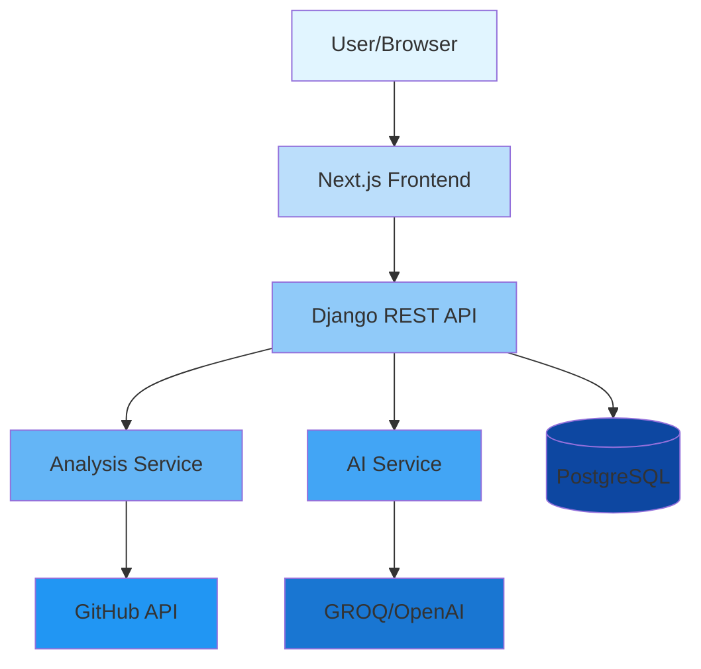

# 📸 Images for README

This directory contains all images used in the main README.md file.

## Required Images

### 1. **banner.png** (1200x400px)
**Purpose:** Header banner for the README
**Content:** 
- Project logo/name "RepoLense AI"
- Tagline: "AI-Powered Repository Analysis"
- Modern gradient background (purple/blue/teal)
- Clean, professional design

**Tools to create:**
- Canva: https://canva.com (easy, free templates)
- Figma: https://figma.com (professional)
- Photopea: https://photopea.com (Photoshop alternative)

---

### 2. **features.png** (1000x600px)
**Purpose:** Visual summary of 4 key features
**Content:** 2x2 grid with icons and text:
- 🏛️ Architecture Analysis
- 🎨 Code Quality
- 🤖 AI Insights
- 👥 Collaboration Metrics

**Alternative:** Create 4 separate icons (200x200px each) instead of one image

---

### 3. **screenshot-home.png** (1200x800px)
**Purpose:** Landing page screenshot
**How to create:**
1. Visit https://repolense.vercel.app
2. Press F12 (DevTools)
3. Click device toolbar (mobile icon)
4. Set to Desktop HD (1920x1080)
5. Press F12 to hide DevTools
6. Press F11 for fullscreen
7. Take screenshot (Windows: Win+Shift+S, Mac: Cmd+Shift+4)
8. Crop to 1200x800px

---

### 4. **screenshot-results.png** (1200x800px)
**Purpose:** Analysis results page
**How to create:**
1. Analyze a repository on https://repolense.vercel.app
2. When results appear, take screenshot
3. Use same method as above
4. Crop to show the key metrics and scores

---

### 5. **screenshot-breakdown.png** (1200x800px)
**Purpose:** Detailed report/metrics view
**How to create:**
1. Scroll down on results page to detailed sections
2. Capture the most interesting/impressive metrics
3. Same screenshot method
4. Crop to highlight the best parts

---

### 6. **architecture-diagram.png** (1000x700px)
**Purpose:** System architecture diagram
**Content:** Show the flow:
- Frontend (Next.js/React)
- API Gateway (Django REST)
- Business Logic layers
- Database & External APIs (GitHub, AI)

**Tools to create:**
- Excalidraw: https://excalidraw.com (free, hand-drawn style)
- Draw.io: https://draw.io (professional diagrams)
- Figma: https://figma.com
- Mermaid: https://mermaid.live (code-based diagrams)

**Mermaid example** (you can paste this in https://mermaid.live):


---

## Quick Image Creation Workflow

### Option 1: Screenshots (Easiest)
1. Visit your live site: https://repolense.vercel.app
2. Use browser DevTools responsive mode
3. Set viewport to 1920x1080
4. Take screenshots of different pages
5. Crop to specified dimensions

### Option 2: Design Tools (Best Quality)
1. **Banner:** Use Canva's "LinkedIn Banner" template (1584x396), resize to 1200x400
2. **Features:** Use Canva's "Infographic" template
3. **Architecture:** Use Excalidraw or Draw.io

### Option 3: AI Generation (Fast)
Use AI tools like:
- DALL-E 3: https://openai.com/dall-e-3
- Midjourney: https://midjourney.com
- Ideogram: https://ideogram.ai

**Prompt example for banner:**
```
Create a modern, professional tech banner for "RepoLense AI", 
an AI-powered GitHub repository analysis tool. 
Use gradient colors (purple, blue, teal). 
Include subtle code/tech elements in the background. 
Clean, minimalist design. 1200x400 pixels.
```

---

## Image Optimization

Before adding to GitHub, optimize images:

1. **Online tools:**
   - TinyPNG: https://tinypng.com
   - Squoosh: https://squoosh.app

2. **Target sizes:**
   - Banner: < 200KB
   - Screenshots: < 300KB each
   - Diagrams: < 150KB

3. **Format:** Use PNG for screenshots, SVG for diagrams (if possible)

---

## Alternative: Use Placeholder Images

If you don't have images yet, you can use placeholder services:

```markdown

```

Or create a simple issue noting "Images coming soon" and add them later.

---

## Need Help?

- Design inspiration: https://github.com/matiassingers/awesome-readme
- Diagram examples: https://github.com/pittcsc/Summer2024-Internships
- Screenshot tools: https://www.screely.com (adds browser chrome)
